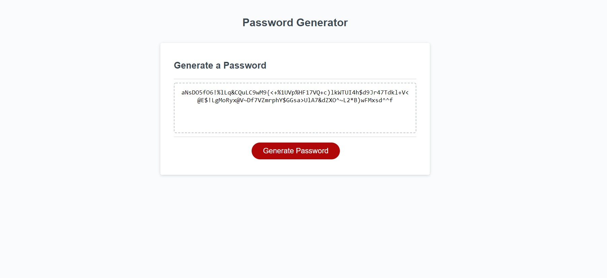

# divined-password

## Purpose
This webpage generates a random password dependant on:
* The desired password length of a user
* The selected characters to include

## Outline
The script function works by:
* First asking a user to select a password length between 8-128
* Then asking the user to "confirm" which characters to use between uppercase, lowercase, numbers, and symbols.
* Selected character arrays are stored 
* The function then runs a for loop selecting random characters from the stored characters until it has reached the desired password length
* This generated password is then displayed in the window for the user.

## Built with 
* Javascript

## Screenshot

## Website
https://j-maclellan.github.io/divined-password/

## Contributor
*j-maclellan
